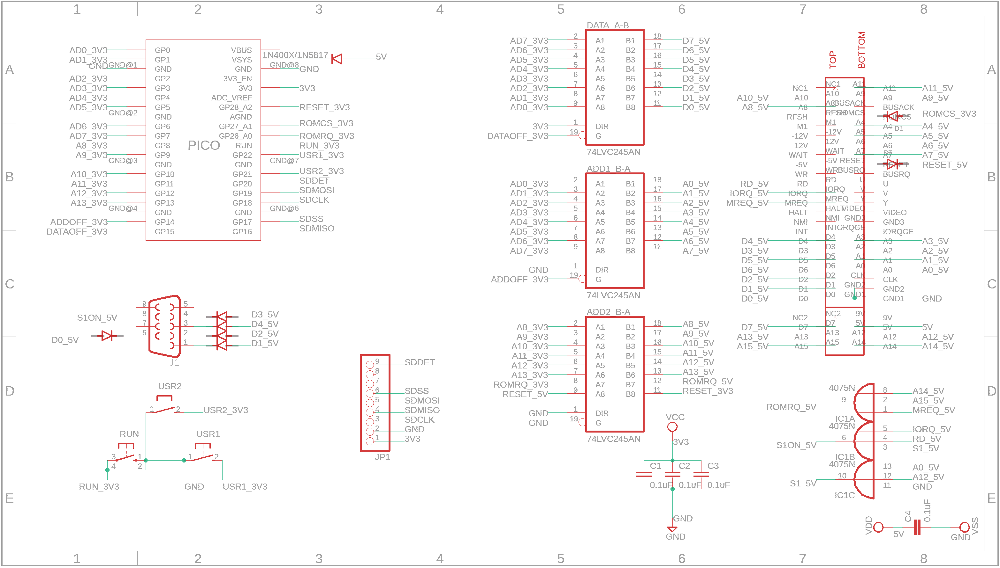

# ZXPicoIF2_v2

Sinclair Interface 2 replacement including ROM Cartridge emulation using a Raspberry Pico. This is a new version of the original ZXPicoIF2 (https://github.com/TomDDG/ZXPicoIF2Lite) with the main change being it uses a micro SD Card instead of flash memory. As with the original the main purpose of this interface is to replicate the Sinclair Interface 2 allowing the user to load ROMs and Z80/SNA snapshots.

## Multiplexing

In order to accommodate the uSD Card reader I had to free up some GPIOs. To do this I multiplexed A0-A7 so they are also D0-D7. This is possible as both busses sit behind bus transceivers which can be switched into high impedance. I used the PiO to flip between input and output while also switching the two bus transceivers on and off.

````
.program zxpicoif2
.wrap_target
    set pins 0b10 // data=OFF, address=ON
    wait 0 gpio 26 // wait for ROMRQ (A14,A15,MREQ & RD) to go low
    in pins 14 // shift in 14 bits from i/o pins to ISR, auto push enabled ISR to RX FIFO
    out pins 8 // auto pull in data from TX FIFO and shift 8 bits from OSR to i/o pins
    set pins 0b01 // data=ON, address=OFF    
    wait 1 gpio 26 // wait for ROMRQ to go high
.wrap
````

With the set-up code being

````
pioAddr=pio0; // use pio 0
addr_data_sm=pio_claim_unused_sm(pioAddr,true); // grab an free state machine from PIO 0
uint addr_data_offset=pio_add_program(pioAddr,&zxpicoif2_program); // get instruction memory offset for the loaded program
pio_sm_config addr_data_config=zxpicoif2_program_get_default_config(addr_data_offset); // get the default state machine config
for(uint i=PIN_AD0;i<PIN_AD0+16;i++) pio_gpio_init(pioAddr,i); // initialise all 14 GPIOs used

// set-up IN address pins    
sm_config_set_in_pins(&addr_data_config,PIN_AD0); // set IN pin base
sm_config_set_in_shift(&addr_data_config,false,true,14); // shift left 14 pins (A13-A0) into ISR, auto push

// set-up OUT data pins    
sm_config_set_out_pins(&addr_data_config,PIN_AD0,8); // set OUT pin base & number (bits)
sm_config_set_out_shift(&addr_data_config,true,true,8); // right shift 8 bits of OSR to pins (D0-D7) with autopull off
pio_sm_set_consecutive_pindirs(pioAddr,addr_data_sm,PIN_AD0,8,true); // set all output pins to output, D0-D7

// set-up SET pins to control the bus transceivers
sm_config_set_set_pins(&addr_data_config,PIN_ADDOFF,2);
pio_sm_set_consecutive_pindirs(pioAddr,addr_data_sm,PIN_ADDOFF,2,true); // set to output

// initialise state machine but do not start yet    
pio_sm_init(pioAddr,addr_data_sm,addr_data_offset,&addr_data_config); // reset state machine and configure it

// start PIO state machine
pio_sm_set_enabled(pioAddr,addr_data_sm,true); // enable state machine
````

## Circuit



## PCBs

Gerber's for v2.2 of the PCB is available here (./Gerbers/ZXPicoIF2_v2.2_2024-11-01.zip). Please note this is a WiP build and hasn't been fully tested yet.


