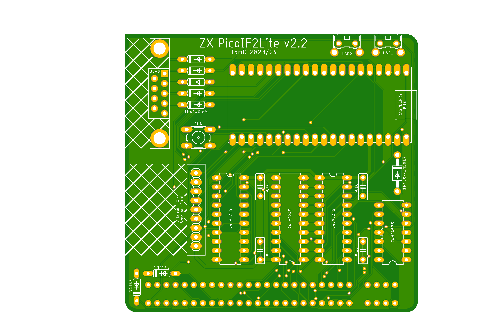
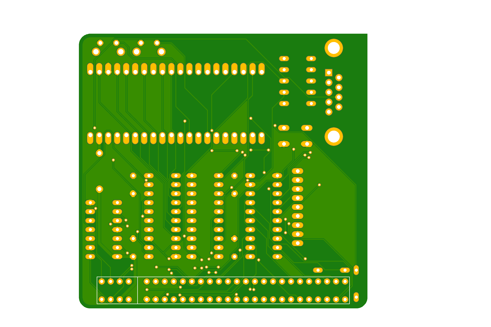

# ZXPicoIF2_v2

Sinclair Interface 2 replacement including ROM Cartridge emulation using a Raspberry Pico. This is a new version of the original ZXPicoIF2 (https://github.com/TomDDG/ZXPicoIF2Lite) with the main change being it uses a micro SD Card instead of flash memory. As with the original the main purpose of this interface is to replicate the Sinclair Interface 2 allowing the user to load ROMs and Z80/SNA snapshots.

## Multiplexing

In order to accommodate the uSD Card reader I had to free up some GPIOs. To do this I multiplexed A0-A7 so they are also D0-D7. This is possible as both busses sit behind bus transceivers which can be switched into high impedance. I then used the PiO to flip between input and output while also switch the two bus transceivers on and off.

````
.program zxpicoif2
.wrap_target
    set pins 0b10 // data=OFF, address=ON
    wait 0 gpio 26 // wait for ROMRQ (A14,A15,MREQ & RD) to go low
    in pins 14 // shift in 14 bits from i/o pins to ISR, auto push enabled ISR to RX FIFO
    out pins 8 // auto pull in data from TX FIFO and shift 8 bits from OSR to i/o pins
    set pins 0b01 // data=ON, address=OFF    
    wait 1 gpio 26 // wait for ROMRQ to go high
.wrap
````

## Gerber's

v2.2 of the PCB is available here (./Gerbers/ZXPicoIF2_v2.2_2024-11-01.zip). Please note this is a WiP build and hasn't been fully tested yet.




